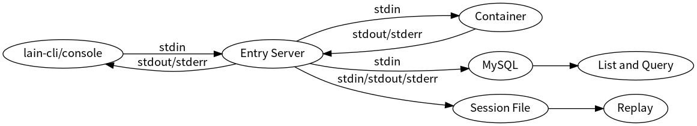
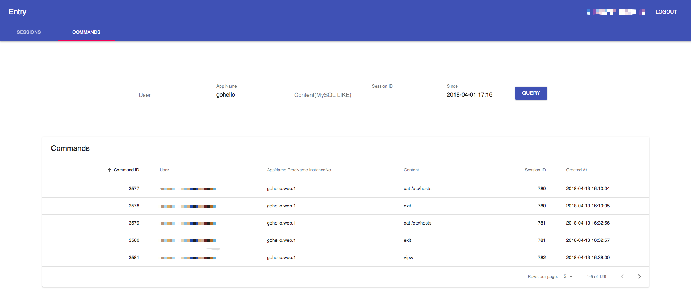
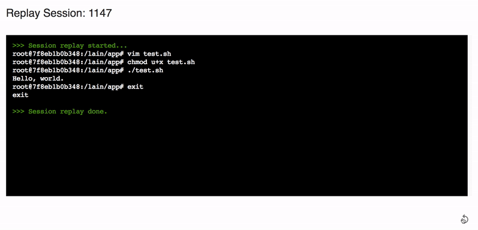
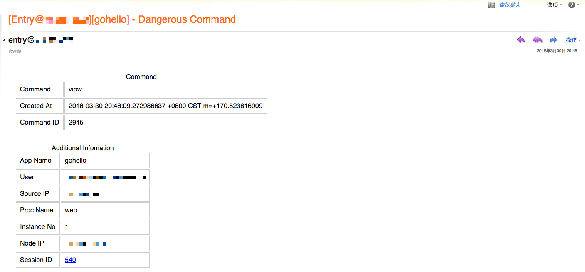

## 作者简介

张凯：云平台开发工程师，来自宜信大数据创新中心云平台团队，参与设计和维护了
[LAIN][lain]。[LAIN][lain] 是宜信大数据创新中心开发的一款私有云平台（PaaS），面
向技术栈多样、寻求高效运维方案的高速发展中的组织、DevOps 人力缺乏的创业公司以及
个人开发者，提供了从编译、部署和扩容到日志、监控和报警的整体解决方案。

&nbsp;

&nbsp;

在虚拟机时代，人们通过堡垒机进入虚拟机管理其中的应用；与此同时，堡垒机会验证用户
的身份、记录用户的会话，以便进行安全审计。进入容器时代后，我们也需要类似的系统，
一方面为开发人员提供管理应用的手段，另一方面则验证操作者的身份、记录操作者的行为，
实现与堡垒机类似的安全功能。[LAIN Entry][entry] 即是容器平台的堡垒机，为开发者提
供了类似于堡垒机的便利性与安全性。

## 传统堡垒机

堡垒机，也称跳板机，是一类可作为跳板批量操作远程设备的网络设备，一般通过 `ssh`
协议实现远程管理[@wikipedia-bastion]。为了保证操作的安全性，堡垒机一般需要支持用
户认证和权限管理，即一方面验证用户身份（比如与 `LDAP` 集成），另一方面管理用户能
以什么权限登录哪些远程设备。此外，一个成熟的堡垒机系统也会提供审计功能，比如可以
检索用户在远程设备上输入过的命令，回放用户在远程设备上的会话，乃至拦截 `rm -rf
/` 等危险命令。以传统堡垒机为目标，我们在 [LAIN Entry][entry] 上实现了类似的功能。

## 容器的进入

{#fig:enterContainer}

如 [@fig:enterContainer] 所示，用户通过 [lain-cli][lain-cli] 或者
[console][console] 前端页面访问 `entry`，`entry` 在用户和容器之间建立一个全双工
管道，转发 stdin/stdout/stderr。`Entry` 与用户之间的连接采用 `websocket` 协议，
与容器之间的连接则为 `rpc` 协议（即通过docker api 连接）。在建立与容器的连接之前，
`entry` 首先向 [LAIN SSO][sso] 验证身份和权限：此用户是否是合法用户？是否是此容
器的所有者？只有容器的所有者才能进入相应容器。

## 用户命令的检索

在 [@fig:enterContainer] 中，`entry` 还把 `stdin` 写入了 `MySQL`，这是为了将来检
索用户命令。效果如 [@fig:searchCommands] 所示，可以按用户名、应用名或者命令内容
等等检索历史命令，以便进行审计。`stdin` 是二进制的字节流，怎么把它变成一系列的用
户命令呢？首先，回车键[^asciiCR]是一行用户命令结束的标志，我们以此对 `stdin` 进
行分割；其次，我们假定用户使用 `Unicode` 字符集[^unicodePresume]，先把字节流转换
成 `Unicode` 码位[^codePoint]流，最终使用 `utf-8` 编码存入 `MySQL`。

{#fig:searchCommands}

但我们遇到了两个问题，一是 stdin 里有控制字符，原样存储会导致乱码；二是用户命令
并不全部来自 stdin，也有可能来自容器的 stdout/stderr，一点都不处理 stdout/stderr
的话同样会导致乱码。下面分享一下我们的解决方案。

### stdin 里的控制字符

ASCII 码里有一些控制字符，并不需要显示，而是有特殊含义。比如当用户按下删除键
（`Backspace/Delete`）时，stdin 里会收到 `127`，表示删除用户输入的一个字符；用户
按下 `ctrl-a` 时，stdin 会收到 `1`，表示跳到行首，等等。
[@tbl:specialBytesInStdin] 是我们整理的特殊字符列表。我们需要根据这些控制字符的
实际含义处理用户输入，而不应该把控制字符直接存入数据库，因为那样的话会有乱码，不
利于将来的检索。

用户输入         stdin 收到的字节（十进制）  含义
---------        --------------------------  ----
ctrl-a           1                           跳到行首
ctrl-b           2                           光标向后移动一个字符
ctrl-d           4                           删除光标下的一个字符
ctrl-e           5                           跳到行尾
ctrl-f           6                           光标向左移动一个字符
ctrl-k           11                          删除光标后的所有字符
ctrl-l           12                          清屏
ctrl-u           21                          删除光标前的所有字符
ctrl-w           23                          删除光标前的一个单词
Right Arrow      [27, 91, 67]                光标向右移动一个字符
Left Arrow       [27, 91, 68]                光标向左移动一个字符
alt-b            [27, 98]                    光标向左移动一个单词
alt-f            [27, 102]                   光标向右移动一个单词
Backspace/Delete 127                         删除光标前的一个字符

: stdin 里的控制字符 {#tbl:specialBytesInStdin}

### 来自 stdout/stderr 的用户命令

其实用户命令并不全部来自 stdin。比如，当用户按下 `Tab` 键时，补全的内容会从容器
的 `stdout/stderr` 传递过来，然后显示在用户的屏幕上；同样地，当用户按下向上的箭
头时，上一个历史命令会从容器的 `stdout/stderr` 传递过来，然后显示在用户的屏幕上；
向下箭头也会触发 `stdout/stderr` 传递下一个历史命令。当检测到这些特殊字符时，我
们会在 `stdin` 和 `stdout/stderr` 之间同步数据，以复现用户的实际输入。

## 用户会话的回放

上面的命令检索已经可以审计大部分的用户操作了，但当用户 `vim` 某个文件时，我们还
是无法看到用户做了哪些更改；另外，命令检索只能看到用户的输入，无法检索相应的输出。
这 2 个缺点可以用会话回放来克服，效果如 [@fig:sessionReplay] 所示，底层采用
`scriptreplay` 实现。

{#fig:sessionReplay}

## 危险命令的报警

命令检索和会话回放都是事后审计，我们还提供了对危险命令的事前预警，以便及时拦截和
处理危险命令，防患于未然。报警邮件如 [@fig:dangerousCommand] 所示。

{#fig:dangerousCommand}

## `Entry` 数据的保护

还有一个最重要的问题，`entry` 可以审计用户对其他容器的操作，那谁来审计用户对
`entry` 自己的操作呢？万一有人偷偷修改 `entry` 的数据库和会话文件，怎么办？我们
的方案也很简单 -- 用堡垒机审计用户对 `entry` 的操作，如
[@fig:auditEntryByBastion] 所示：应用所有者只能进入 `entry` 之外的容器；如果想要
进入 `entry`，必须通过堡垒机登录，先进入 LAIN 节点（即容器的宿主机），再进入容器。
这个策略保证了用户对 `entry` 会话文件的修改都可被追溯。

{#fig:auditEntryByBastion}

另外，`entry` 在 MySQL 里的表也需要审慎授权：

```
grant select, insert, update(status, ended_at, updated_at) on \
      entry.sessions to entry@'xxx';
grant select, insert on entry.commands to entry@'xxx';
```

我们只赋予了 `entry@'xxx'` 这个 MySQL 用户对 `entry.sessions` 和
`entry.commands` 的读取和插入权限，再加上对 `entry.sessions` 里 `status`、
`ended_at` 和 `updated_at` 字段的更新权限。这样，任何人无法从远端删除记录或者更
新 `user` 和 `source_ip` 等其他字段；唯一的办法是在数据库所在的机器上用
`root@localhost` 修改，而这种操作又会被堡垒机记录下来。因此，通过上面两种手段的
结合，我们保证了 `entry` 的数据不容易被篡改；即便被篡改，也可以追溯，形成了一个
完整的闭环，能够可靠地审计用户对容器的所有操作。

最后，欢迎大家使用 [Entry][entry]。

[lain]: https://laincloud.com/
[entry]: https://github.com/laincloud/entry
[sso]: https://github.com/laincloud/sso
[lain-cli]: https://github.com/laincloud/lain-cli
[console]: https://github.com/laincloud/console

[^unicodePresume]: 当前大部分终端均默认使用 `Unicode` 字符集，我们认为这是一个合理的假定。
[^codePoint]: 即 `Unicode` 中的 `Code Point`。
[^asciiCR]: 即字节 `13`（十进制）。

## 参考文献
